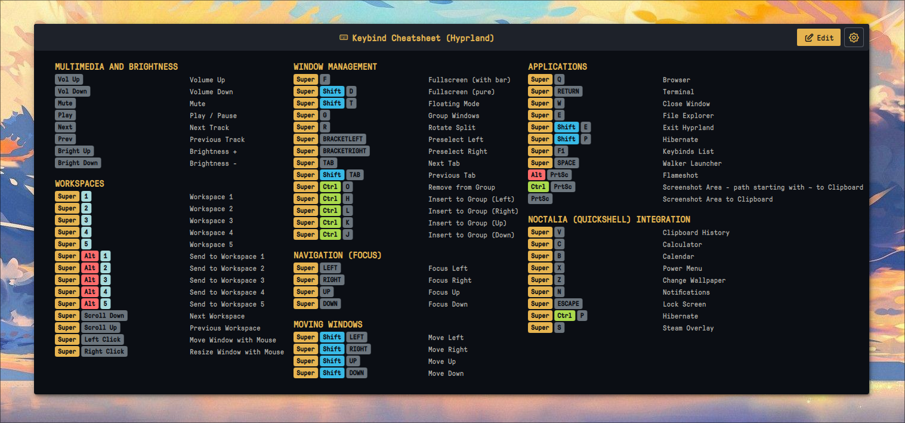
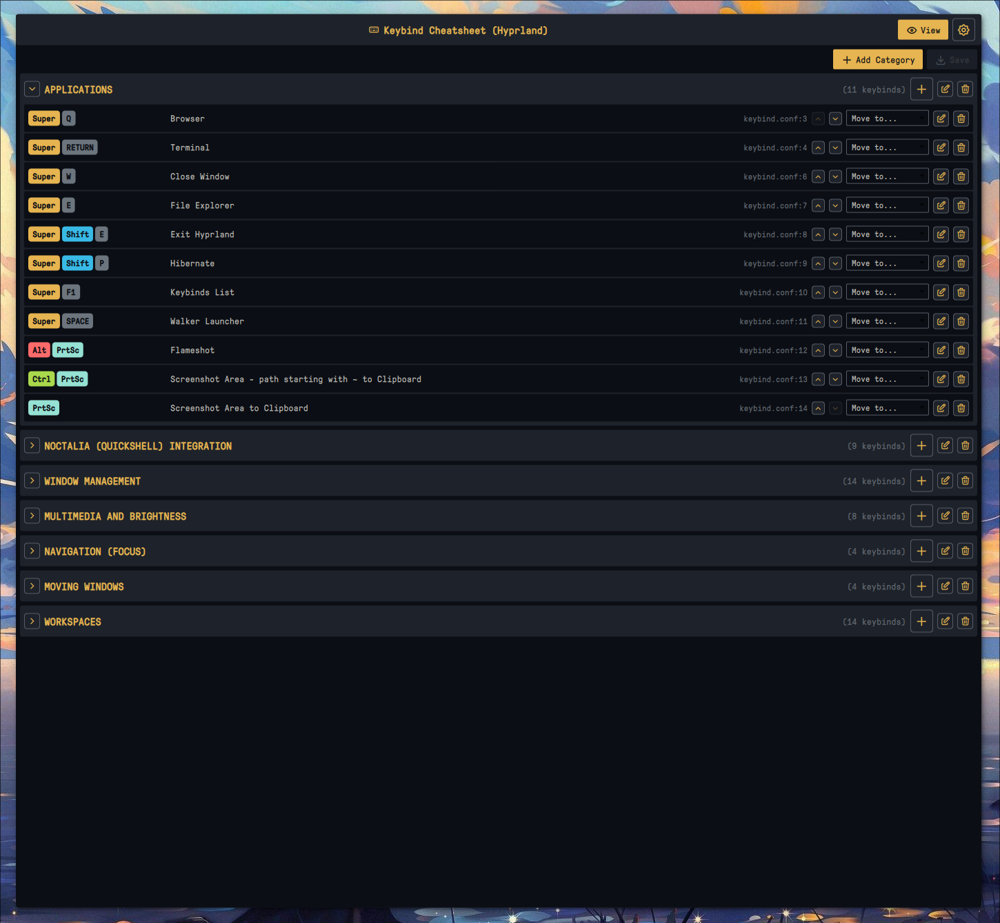
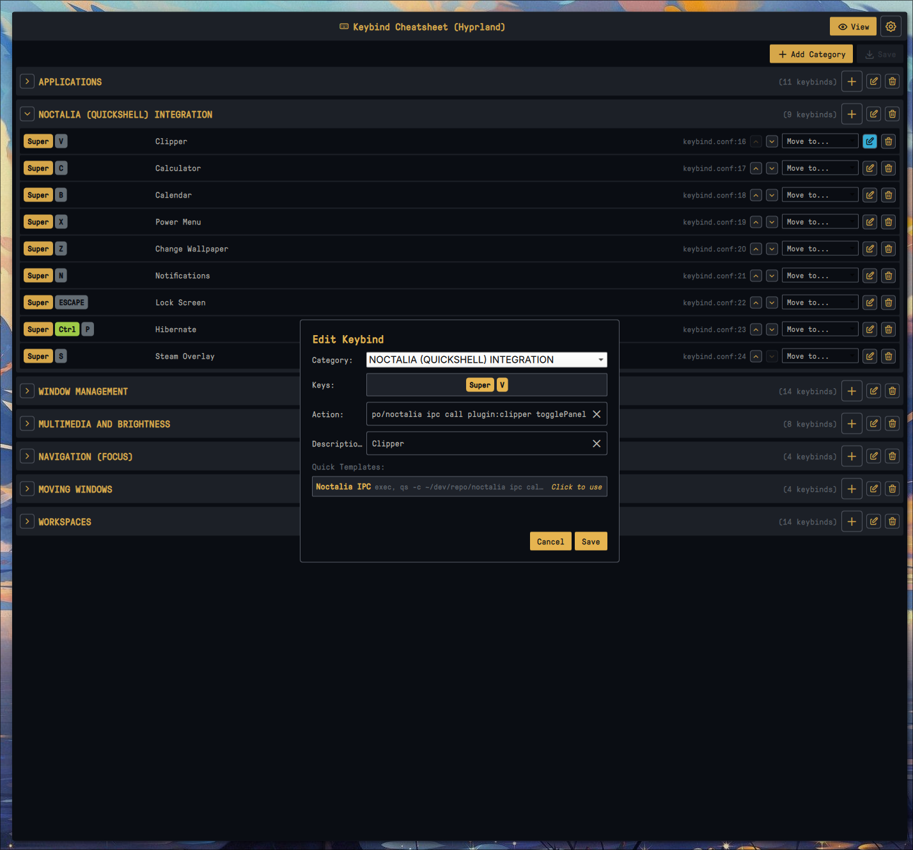

# Keybind Cheatsheet for Noctalia

Universal keyboard shortcuts cheatsheet plugin for Noctalia with **built-in editor**, **automatic compositor detection** (Hyprland/Niri), and **recursive config parsing**.



## Features

### Cheatsheet View
- **Automatic compositor detection** (Hyprland or Niri)
- **Recursive config parsing** - follows all `source` (Hyprland) and `include` (Niri) directives
- **Glob pattern support** - parses `~/.config/hypr/*.conf` style includes
- **Smart key formatting** - XF86 keys display as readable names (Vol Up, Bright Down, etc.)
- **Color-coded modifier keys** (Super, Ctrl, Shift, Alt)
- **Flexible column layout** (1-4 columns)
- **Auto-height** - adjusts to content automatically
- **IPC support** - global hotkey toggle

### Built-in Editor (v2.0)



- **Add/Edit/Delete keybinds** - full CRUD operations directly in the UI
- **Add/Rename/Delete categories** - organize your keybinds (Hyprland only)
- **Reorder keybinds** - move up/down within categories
- **Move keybinds between categories** - drag to different category (Hyprland)
- **Quick templates** - Noctalia IPC command template for easy plugin integration
- **Live config reload** - changes are saved directly to your config files
- **Flat view for Niri** - categories are auto-assigned based on action type



## Supported Compositors

| Compositor | Default Config | Format |
|------------|----------------|--------|
| **Hyprland** | `~/.config/hypr/hyprland.conf` | Hyprland config format |
| **Niri** | `~/.config/niri/config.kdl` | KDL format |

## Installation

```bash
cp -r keybind-cheatsheet ~/.config/noctalia/plugins/
```

## Usage

### Bar Widget

Add the plugin to your bar configuration in Noctalia settings. Click the keyboard icon to open the cheatsheet.

### Global Hotkey

#### Hyprland

```bash
bind = $mod, F1, exec, qs -c noctalia-shell ipc call plugin:keybind-cheatsheet toggle
```

#### Niri

```kdl
binds {
    Mod+F1 { spawn "qs" "-c" "noctalia-shell" "ipc" "call" "plugin:keybind-cheatsheet" "toggle"; }
}
```

## Config Format

### Hyprland

The plugin recursively parses your main config and all source includes.

**Keybind format:**

```bash
# 1. APPLICATIONS
bind = $mod, T, exec, alacritty #"Terminal"
bind = $mod, B, exec, firefox #"Browser"

# 2. WINDOW MANAGEMENT
bind = $mod, Q, killactive, #"Close window"
bind = $mod, F, fullscreen, #"Toggle fullscreen"

# 3. WORKSPACES
bind = $mod, 1, workspace, 1 #"Workspace 1"
bind = $mod SHIFT, 1, movetoworkspace, 1 #"Move to workspace 1"
```

**Requirements:**
- **Categories:** `# N. CATEGORY NAME` (where N is a number)
- **Descriptions:** `#"description"` at end of bind line
- **Modifiers:** Your configured variable (default `$mod`, configurable in settings), `SHIFT`, `CTRL`, `ALT`

**Source directives (automatically followed):**

```bash
source = ~/.config/hypr/keybinds.conf
source = ~/.config/hypr/apps/*.conf
```

### Niri

The plugin parses the `binds { }` block and follows all include directives.

**Keybind format:**

```kdl
binds {
    // #"Applications"
    Mod+T hotkey-overlay-title="Terminal" { spawn "alacritty"; }
    Mod+B hotkey-overlay-title="Browser" { spawn "firefox"; }

    // #"Window Management"
    Mod+Q hotkey-overlay-title="Close window" { close-window; }
    Mod+F hotkey-overlay-title="Fullscreen" { fullscreen-window; }

    // #"Workspaces"
    Mod+1 { focus-workspace 1; }
    Mod+2 { focus-workspace 2; }
}
```

**Requirements:**
- **Categories:** `// #"Category Name"` (must use this exact format)
- **Descriptions:** `hotkey-overlay-title="description"` attribute
- Without descriptions, actions are auto-categorized by type

**Include directives (automatically followed):**

```kdl
include "~/.config/niri/binds.kdl"
```

## Auto-Categorization (Niri)

When no category comment is provided, keybindings are grouped by action:

| Action prefix | Category |
|--------------|----------|
| `spawn` | Applications |
| `focus-column-*` | Column Navigation |
| `focus-window-*` | Window Focus |
| `focus-workspace-*` | Workspace Navigation |
| `move-column-*` | Move Columns |
| `move-window-*` | Move Windows |
| `close-window`, `fullscreen-window` | Window Management |
| `maximize-column` | Column Management |
| `set-column-width` | Column Width |
| `screenshot*` | Screenshots |
| `power-off-monitors` | Power |
| `quit` | System |

## Special Key Formatting

XF86 and other special keys are automatically formatted:

| Raw Key | Display |
|---------|---------|
| `XF86AudioRaiseVolume` | Vol Up |
| `XF86AudioLowerVolume` | Vol Down |
| `XF86AudioMute` | Mute |
| `XF86MonBrightnessUp` | Bright Up |
| `XF86MonBrightnessDown` | Bright Down |
| `Print` | PrtSc |
| `Prior` / `Next` | PgUp / PgDn |

## Settings

Access settings via the gear icon in the panel header:

- **Window width** - 400-3000px
- **Height** - Auto or manual (300-2000px)
- **Columns** - 1-4 columns
- **Config paths** - Custom paths for Hyprland/Niri configs
- **Mod Key Variable** - Customize the variable used for Super key (e.g. `$mod` or `$mainMod`)
- **Refresh** - Force reload keybindings

## Editor Usage

1. Click **Edit** button in the top-right corner to enter edit mode
2. Use **+ Add Category** to create new categories (Hyprland only)
3. Use **+ Add Keybind** to add new keybinds
4. Click the **edit** icon on any keybind to modify it
5. Use **arrow buttons** to reorder keybinds within a category
6. Click **Save** to write changes to your config file
7. Click **Discard** to cancel all changes

### Quick Templates

When adding a new keybind, use the **Noctalia IPC** template to quickly insert a command for calling other Noctalia plugins:

```bash
exec, qs -c /path/to/noctalia ipc call
```

## Troubleshooting

### "Loading..." stays forever

- Check compositor is detected: look for logs with `[KeybindCheatsheet]`
- Verify config file exists at the configured path
- Ensure keybinds have proper format with descriptions

### No categories found

- **Hyprland:** Categories must start with `# 1.`, `# 2.`, etc.
- **Niri:** Use `// #"Category Name"` format for custom categories

### Keybinds parsing issues

If your keybinds are not showing up, check if you are using a custom variable for the Super key (e.g. `$mainMod`). Go to settings and update the **Mod Key Variable** field.

### Keybinds from included files not showing

The plugin follows `source` (Hyprland) and `include` (Niri) directives automatically. Check logs to see which files are being parsed.

### Editor save failed

- Ensure you have write permissions to your config file
- Check if the config file path is correct in settings
- For Niri: the compositor will validate and reload the config automatically

## Requirements

- Noctalia Shell 3.6.0+
- Hyprland or Niri compositor

## Changelog

### v2.0.0
- Added built-in keybind editor
- Add/Edit/Delete keybinds and categories
- Reorder keybinds within categories
- Move keybinds between categories (Hyprland)
- Quick templates for Noctalia IPC
- Flat view for Niri (auto-categorization)
- Full i18n support (13 languages)

### v1.0.0
- Initial release
- Cheatsheet view with recursive config parsing
- Auto-detection of Hyprland/Niri
- Color-coded modifier keys
- Flexible column layout

## License

MIT
